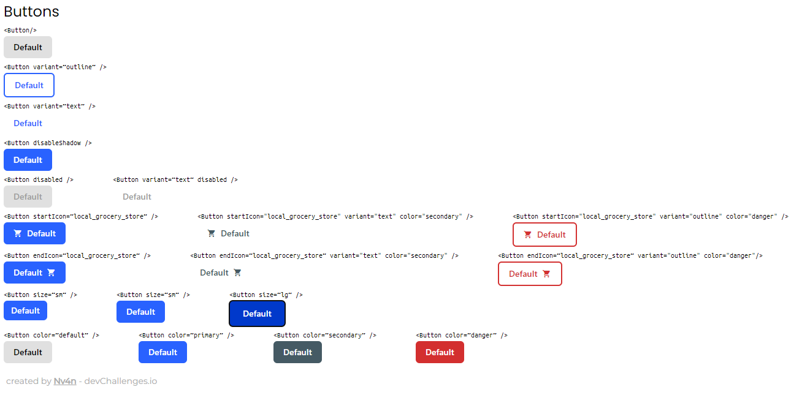

<!-- Please update value in the {}  -->

<h1 align="center">button-component</h1>

<div align="center">
   Solution for a challenge from  <a href="http://devchallenges.io" target="_blank">Devchallenges.io</a>.
</div>

<div align="center">
  <h3>
    <a href="https://button-component-master-six.vercel.app">
      Demo
    </a>
    <span> | </span>
    <a href="https://github.com/Nv4n/button-component-master">
      Solution
    </a>
    <span> | </span>
    <a href="https://devchallenges.io/challenges/ohgVTyJCbm5OZyTB2gNY">
      Challenge
    </a>
  </h3>
</div>

<!-- TABLE OF CONTENTS -->

## Table of Contents

- [Overview](#overview)
  - [Built With](#built-with)
- [Features](#features)
- [How to use](#how-to-use)
- [Contact](#contact)

<!-- OVERVIEW -->

## Overview



- Where can I see your demo?
- What was your experience? 
Tailwindcss felt slow at first, but later on it got a bit easier with each component variant
- What have you learned/improved? 
I learnt multiple ways of creating variants of a component with tailwindcss
- Your wisdom? :)
It's always good to push yourself to learn 1 more thing and get deeper with the stuff you already know

### Built With

<!-- This section should list any major frameworks that you built your project using. Here are a few examples.-->

- [React](https://reactjs.org/)
- [Tailwind](https://tailwindcss.com/)

## Features

<!-- List the features of your application or follow the template. Don't share the figma file here :) -->

This application/site was created as a submission to a [DevChallenges](https://devchallenges.io/challenges) challenge. The [challenge](https://devchallenges.io/challenges/ohgVTyJCbm5OZyTB2gNY) was to build an application to complete the given user stories.

## How To Use

<!-- This is an example, please update according to your application -->

To clone and run this application, you'll need [Git](https://git-scm.com), [Node.js](https://nodejs.org/en/download/) and [Yarn](https://yarnpkg.com) installed on your computer. From your command line:

```bash
# Clone this repository
$ git clone https://github.com/Nv4n/button-component-master

# Install dependencies
$ yarn install

# Run the app
$ yarn dev
```

## Contact

- GitHub [@Nv4n](https://github.com/Nv4n)
